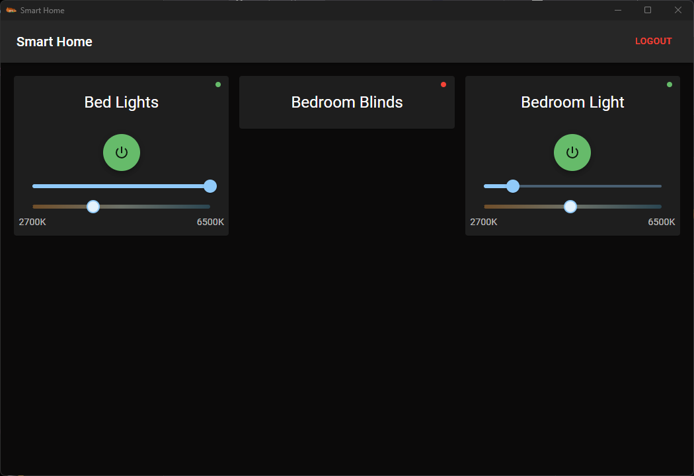

# Smart Home Control Electron App (Smart Life / Tuya)

This app was created so that I can control smart home devices from a desktop computer because there was apparently no existing solution. This could also easily be converted to a web app running on a local network.

This app interacts with the Smart Life or Tuya "api" which are both quite popular in smart home tech.

Anyway the API has no documentation that I can find so I have just been doing what I can. You have to input your username and password for your tuya/smartlife account which sends a request and getting an access token which can then be used to fetch the device list or send device actions.

## Currently Supported

- Smart Lights (power, brightness, colour temp)

At the moment only power and brightness for lights are available. Hopefully I can add support for more devices like blinds/switches etc. TODO: Plus I need to add colour changing ability to lights

